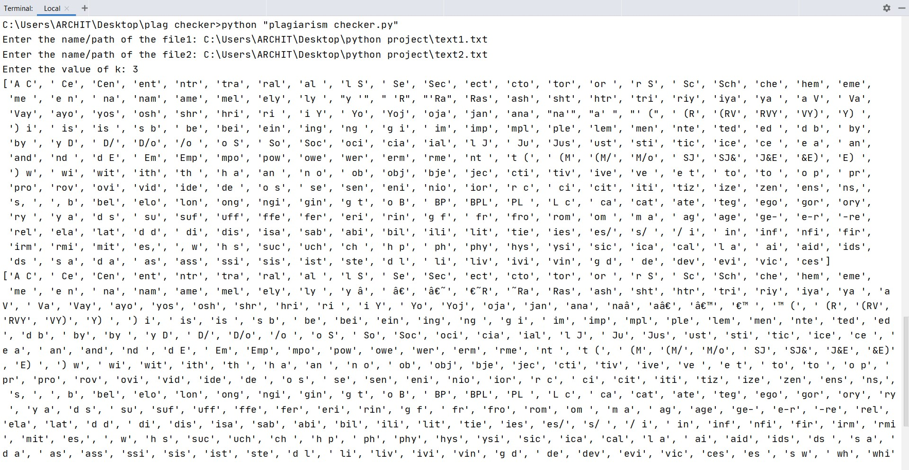
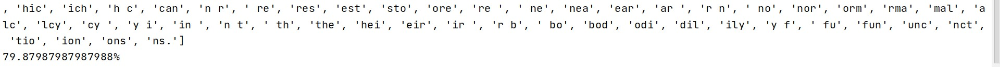
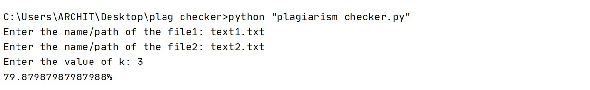

# The Plagiarism Checker

Having two files to check how similar they are?
This program helps you to find the similarity percentage of two files.

### Concept
You would be asked to enter the names/paths of the two files you want to check the plag for.
After that you would be asked to enter an integer, it is for the size of shingles you want, yes this program is based on the shingles concept, that is converting the whole file into shingles of size k for example see the screen shots below.
After converting them into shingles, this program uses the __Jacquard Similarity of the sets of k-shingles__.
The program would be comparing the shingles using the above mentioned similarity method and would be displayed the similarity.

### Usage
Write this command in the cmd:
```shell script
python "plagiarism checker.py"
```
Then you would be asked to enter the names or paths of the files:
```shell script
Enter the name/path of the file1: _file1nameor/path_
Enter the name/path of the file1: _file2nameor/path_
Enter the value of k: Enter the size of shingles to be made(integer only)
```
After this you would be shown the result:
```shell script
percentage shown here
```
__note__ Use the k value 3 for the most optimum result, otherwise you can use any value of k, but the result would be depending upon the size of shingles.
### ScreenShots


